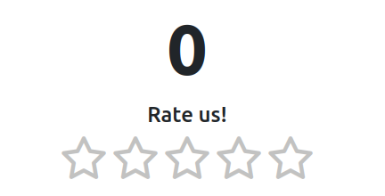

# jQuery star-rating plugin



## OPTIONS

```js
let DEFAULTS = {
    wrapperClasses: 'p-5 shadow',
    starIconEmpty: 'fa fa-star-o',
    starIconFull:'fa fa-star',
    starColorEmpty: 'lightgray',
    starColorFull:'#FFC107',
    starsSize: 4, // em
    stars: 5,
    showInfo:true,
    titles: ["Sehr schlecht", "Schlecht", "Mittel", "Gut", "Sehr gut!"],
    inputName: 'rating'
};
```

## EVENTS

```js
// trigger when star is clicked
$('.rating').on('change', function (e, stars, index) {
});
```

## EXAMPLE

```html

<div class="rating"></div>
```

```javascript
$('.rating').starRating();

$(document).on('change', '.rating', function (e, stars, index) {
    alert(`Thx for ${stars} stars!`);
});
```
